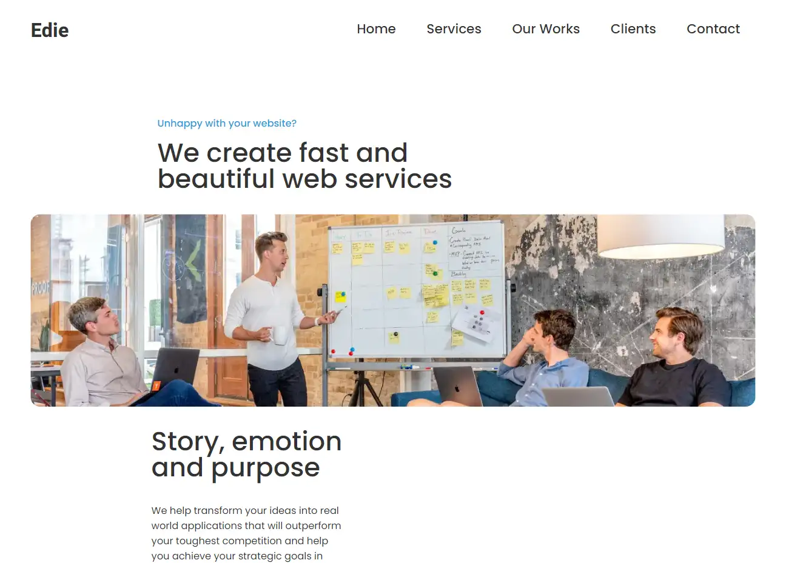
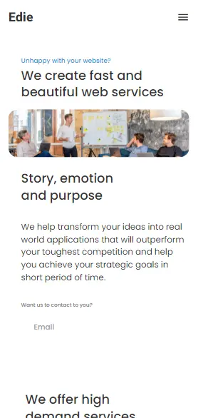
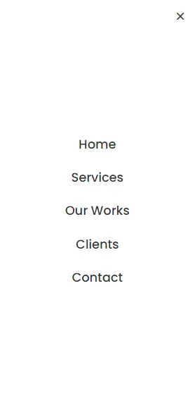

# Edie Home Page

Solution for a challenge from  <a href="http://devchallenges.io" target="_blank">Devchallenges.io</a>.

- [Demo](https://peter-abah.github.io/edie-homepage)
- [Challenge](https://devchallenges.io/challenges/xobQBuf8zWWmiYMIAZe0)

<!-- TABLE OF CONTENTS -->

## Table of Contents

- [Overview](#overview)
  - [Built With](#built-with)
- [Contact](#contact)
- [Acknowledgements](#acknowledgements)

<!-- OVERVIEW -->

## Overview
This is a simple landing page for a fictional company. The design was gotten from [DevChallenges](https://devchallenges.io/challenges/xobQBuf8zWWmiYMIAZe0).

### Desktop Screenshot

### Mobile screenshot

### Built With

<!-- This section should list any major frameworks that you built your project using. Here are a few examples.-->

- HTML
- [Tailwind](https://tailwindcss.com/)
- Mobile First workflow

## Acknowledgements

- [Tailwind Docs](https://tailwindcss.com/docs)

## Contact

- GitHub [@peter-abah](https://github.com/peter-abah)
